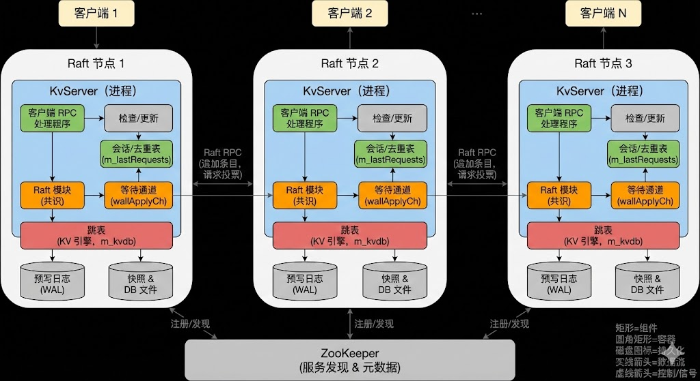
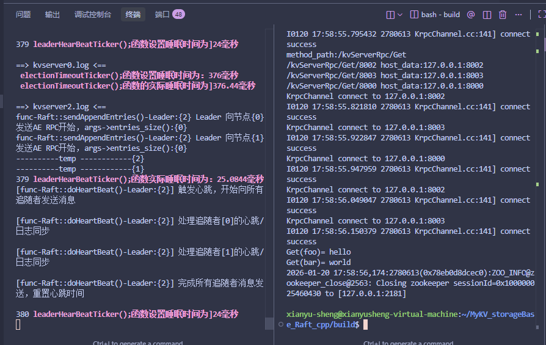

# MyKV_storageBase_Raft_cpp

## 一、项目简介

MyKV_storageBase_Raft_cpp 是一个基于 Raft 共识算法的分布式 KV 存储系统，实现了：

- **多副本容错**：通过 Raft 选举与日志复制提供主从一致性，允许少数节点故障。
- **线性一致的读写**：客户端所有写操作都经由 Leader 串行提交，读操作在已提交日志上执行。
- **自研 RPC 框架（myRPC）**：基于 protobuf 实现的轻量级 RPC 通讯层，支持 ZooKeeper 服务发现。
- **服务发现与多副本路由**：使用 ZooKeeper 维护 KvServer 实例列表，客户端能向多个节点发起请求。
- **持久化与恢复**：利用 Boost.Serialization 等机制持久化 Raft 状态和日志，为后续快照与容错打基础。
- **典型三节点集群**：默认配置为 3 个 Raft 节点（kvserver 进程），组成一个小型分布式存储集群。

该项目适合作为简历上的“分布式存储系统”项目，体现对 Raft、一致性协议、RPC 框架和 ZooKeeper 的理解与工程实践能力。

本项目主要参考并学习自《代码随想录》作者卡哥的分布式存储教学项目，在其基础上做了整理与扩展，便于个人学习、实验和在简历中展示工程实践过程。

---

## 二、项目模块

- **myRPC 通讯层**
  - 封装 TCP + protobuf 的 RPC 调用过程。
  - 包含：
    - `KrpcApplication`：RPC 框架入口，读取配置。
    - [KrpcProvider](cci:1://file:///home/xianyu-sheng/MyKV_storageBase_Raft_cpp/myRPC/Server/Krpcprovider.cc:14:0-19:1)：服务端注册与请求分发，将 protobuf Service 暴露为 RPC 服务。
    - [KrpcChannel](cci:2://file:///home/xianyu-sheng/MyKV_storageBase_Raft_cpp/myRPC/User/KrpcChannel.h:8:0-33:1)：客户端通道，负责序列化请求、连接远端、发送与接收。
    - `KrpcController`：记录每次调用的状态（失败原因等）。
  - 支持两种寻址方式：
    - 通过 ZooKeeper 按 `service/method` 查询可用服务地址。
    - 直接使用 `ip:port` 进行点对点连接（主要用于 Raft 节点间通信）。

- **ZooKeeper 集成（服务发现）**
  - [Zkclient](cci:2://file:///home/xianyu-sheng/MyKV_storageBase_Raft_cpp/myRPC/ZooKeeper/ZooKeeper.h:9:0-24:1)：封装 ZooKeeper C 接口。
  - 功能：
    - 在 `/ServiceName/MethodName` 路径下创建**持久节点**描述服务和方法。
    - 在方法节点下为每个服务实例创建一个以端口命名的**临时子节点**（如 `/kvServerRpc/PutAppend/8000`），节点内数据为 `ip:port`。
    - 客户端通过 [GetChildren](cci:1://file:///home/xianyu-sheng/MyKV_storageBase_Raft_cpp/myRPC/ZooKeeper/ZooKeeper.cc:102:0-118:1) 获取所有可用实例，并支持简单的轮询/随机选择，实现多副本路由。

- **Raft 共识模块**
  - 实现 Raft 的主要状态机逻辑，包括：
    - Leader 选举：Follower 超时发起选举，RequestVote RPC。
    - 日志复制：Leader 周期性发送 AppendEntries 心跳与日志条目。
    - 提交与应用：在多数节点复制成功后推进 `commitIndex`，并将日志应用到状态机（KV 存储）。
  - 参数：
    - 心跳间隔：约 25ms。
    - 选举超时：300–500ms 随机。
  - 提供给上层的接口：
    - [Start](cci:1://file:///home/xianyu-sheng/MyKV_storageBase_Raft_cpp/Raft/Raft.cpp:1124:0-1157:1)：客户端（KvServer）提交一个命令，由 Raft 负责复制和提交。

- **KvServer（分布式 KV 服务）**
  - 每个进程同时包含：
    - 一个 Raft 实例（参与共识）。
    - 一个本地 KV 存储（如跳表 Skip List）。
  - 对外暴露的 RPC：
    - [Get](cci:1://file:///home/xianyu-sheng/MyKV_storageBase_Raft_cpp/Clerk/clerk.cpp:45:0-80:1)：读取键值。
    - [PutAppend](cci:1://file:///home/xianyu-sheng/MyKV_storageBase_Raft_cpp/KvServer/KvServer.cpp:142:0-152:20)：写入或追加值（包含 [Put](cci:1://file:///home/xianyu-sheng/MyKV_storageBase_Raft_cpp/Clerk/clerk.cpp:6:0-43:1) / `Append` 两种操作）。
  - 关键逻辑：
    - 将客户端请求封装成命令，通过 [Raft::Start](cci:1://file:///home/xianyu-sheng/MyKV_storageBase_Raft_cpp/Raft/Raft.cpp:1124:0-1157:1) 提交。
    - 等待对应日志条目在本节点被提交（带超时，例如 `CONSENSUS_TIMEOUT=500ms`）。
    - 日志提交后在本地 KV 中应用，并返回结果。
    - 包含去重逻辑，避免客户端重试导致重复写入。

- **Clerk / 客户端组件**
  - 封装客户端对分布式 KV 集群的访问：
    - 对外提供 [Get(key)](cci:1://file:///home/xianyu-sheng/MyKV_storageBase_Raft_cpp/Clerk/clerk.cpp:45:0-80:1)、[Put(key, value)](cci:1://file:///home/xianyu-sheng/MyKV_storageBase_Raft_cpp/Clerk/clerk.cpp:6:0-43:1)、`Append(key, value)` 等接口。
    - 内部通过 myRPC + ZooKeeper 发现可用 KvServer，支持在遇到 `ErrWrongLeader` 或网络错误时重试其他节点。
  - 可以作为测试程序或 SDK 使用。

- **配置与脚本**
  - 多份 myRPC 配置文件（如 [myrpc_0.conf](cci:7://file:///home/xianyu-sheng/MyKV_storageBase_Raft_cpp/myRPC/conf/myrpc_0.conf:0:0-0:0), [myrpc_1.conf](cci:7://file:///home/xianyu-sheng/MyKV_storageBase_Raft_cpp/myRPC/conf/myrpc_1.conf:0:0-0:0), [myrpc_2.conf](cci:7://file:///home/xianyu-sheng/MyKV_storageBase_Raft_cpp/myRPC/conf/myrpc_2.conf:0:0-0:0), [myrpc.conf](cci:7://file:///home/xianyu-sheng/MyKV_storageBase_Raft_cpp/myRPC/conf/myrpc.conf:0:0-0:0)），分别对应不同节点和客户端。
  - 指定：
    - 本地 RPC 监听地址（`rpcserverip`, `rpcserverport`）。
    - ZooKeeper 地址（`zookeeperip`, `zookeeperport`）。

---

## 三、框架图




- **整体结构层次**
  - 上层：多个客户端（Clerk / kvclient），通过 myRPC 调用 [KvServer](cci:2://file:///home/xianyu-sheng/MyKV_storageBase_Raft_cpp/KvServer/kvServer.h:29:0-70:1) 的 `Get/PutAppend` 接口。
  - 中间层：若干 [KvServer](cci:2://file:///home/xianyu-sheng/MyKV_storageBase_Raft_cpp/KvServer/kvServer.h:29:0-70:1) 实例，每个包含：
    - Raft 模块（Leader/Follower 状态机）。
    - 本地 KV 存储。
  - 底层：ZooKeeper 集群，用于：
    - 记录 [KvServer](cci:2://file:///home/xianyu-sheng/MyKV_storageBase_Raft_cpp/KvServer/kvServer.h:29:0-70:1) 的服务节点。
    - 为 RpcChannel 提供服务发现能力。

- **Raft 内部结构**
  - 三个 Raft 节点之间构成一个完全互联的 RPC 网络（RequestVote / AppendEntries / InstallSnapshot）。
  - Leader 对外服务客户端写请求，Follower 仅接收复制。

- **数据流示意**
  - 客户端发起 [Put](cci:1://file:///home/xianyu-sheng/MyKV_storageBase_Raft_cpp/Clerk/clerk.cpp:6:0-43:1)：
    1. 通过 myRPC + ZooKeeper 连接到某个 KvServer。
    2. KvServer 将命令提交给本地 Raft。
    3. Raft Leader 将日志复制到其他节点。
    4. 达到多数派后提交并应用到本地 KV。
    5. KvServer 返回成功给客户端。
  - 你可以用箭头标出以上 5 步数据流。

---

## 四、一致性与容错保证

这一节回答几个常见的“系统保证什么”问题，方便在面试或阅读代码时快速对应。

### 1. 一致性模型（线性一致 Linearizability）

- **写（Put / Append）路径**
  - 客户端通过 `Clerk::Put/Append` 发起请求，携带 `(ClientId, RequestId)`。
  - KvServer 将请求封装为 `Op`，调用 `Raft::Start(op, &index, &isLeader)`，**所有写请求必须先进入 Raft 日志**。
  - 只有当前节点是 Leader 时才继续处理；否则直接返回 `ErrWrongLeader`，由客户端重试其它节点。
  - KvServer 为每个日志 `index` 在 `waitApplyCh[index]` 上阻塞等待 `ApplyMsg`（例如 `CONSENSUS_TIMEOUT=500ms`）。
  - 当该日志条目在多数节点复制成功并被提交后，Raft 通过 `ApplyMsg` 推送到 KvServer 的 `Apply` 线程，KvServer 在本地 KV 引擎上执行操作并唤醒等待的 RPC。

- **读（Get）路径**
  - 当前实现中，`Get` 同样会被封装为 `Op(Operation="Get")`，通过 `Raft::Start` 写入 Raft 日志，并在 `waitApplyCh[index]` 上等待对应 `ApplyMsg`。
  - 在 `Apply` 中，对于 `Get` 日志不会修改 KV 数据，只是在跳表上读取当前值并记录到去重表中，然后唤醒等待的 RPC。
  - 因为读请求也经过 Raft 日志、只在日志提交后才返回，因此 **提供线性一致的读（Strong Read）**，代价是读性能与写相同级别。

> 总结：当前版本中，所有 `Get/Put/Append` 都经由 Leader 串行提交并等待日志提交后才返回，对外保证线性一致性（Linearizability）。

### 2. 容错能力与恢复

- **Raft 容错模型**
  - 本项目默认部署为 **3 节点 Raft 集群**（3 个 kvserver 进程）。
  - 在任意时刻，只要有 **多数派（≥2 节点）存活且能互相通信**，集群即可对外提供读写服务。
  - 3 节点集群可以容忍 **1 个节点宕机或网络隔离**。

- **持久化与重启恢复**
  - 每个节点都有独立的持久化目录 `./raft_persist`，通过 `Persister` 类管理：
    - `raft_state_<me>`：持久化当前 term、votedFor、Raft 日志等状态；
    - `snapshot_<me>`：持久化可选的快照数据（如压缩后的状态机）。
  - Raft 启动时先从 `Persister` 读取本地 `raft_state` 和 `snapshot`，恢复为最近一次持久化时的状态；
  - 之后通过正常的 Raft 协议（AppendEntries / InstallSnapshot）从当前 Leader 拉取缺失日志或快照，补齐进度。

> 直观理解：单个节点宕机重启后，会从磁盘恢复到上一次持久化的状态，再由 Leader 补齐缺失的日志，从而回到一致视图。

### 3. 幂等与重复请求处理

为了应对网络抖动、客户端重试等情况，系统在 **KvServer 层实现了请求去重与幂等处理**：

- **客户端侧（Clerk）**
  - 每个 Clerk 在 `Init` 时生成一个全局唯一的 `ClientId_`（随机数），并维护单调递增的 `RequestId_`；
  - 每次 `Get/Put/Append` 调用都会带上 `(clientid, requestid)`，发生超时或 `ErrWrongLeader` 时会在客户端重试调用。

- **服务端侧（KvServer）**
  - 在 `Apply` 阶段，KvServer 维护一张最近请求表（例如 `m_lastRequests`），按 `(ClientId, RequestId)` 记录已经执行过的请求和结果；
  - 收到新的 `ApplyMsg` 时，若发现该 `(clientId, requestId)` 已存在，则认为是重复请求，根据记录的结果直接返回，**不再对 KV 引擎执行写入**；
  - 在 `Get` / `PutAppend` 的 RPC 处理函数中，如果等待 Raft 日志提交超时，会根据 `ifRequestDuplicate` 判断该请求是否已经在后台被提交并应用：
    - 若是重复请求（说明已经在某次尝试中成功提交），则直接返回 `OK`；
    - 否则返回 `ErrWrongLeader`，交由客户端切换节点重试。

通过上述机制，即使客户端因为网络原因重试多次，最终也只会有 **一次真实写入生效**，其余重试都被去重，保证幂等性。

---

## 五、设计说明与常见问题

这一节从“面试官视角”回答几个常见问题，帮助快速把代码和架构图对上号。

### 1. 为什么读也走 Raft 日志，而不是直接读本地 KV？

- 当前实现中，`Get` 被当作一种特殊的 `Op` 写入 Raft 日志，并在提交后才返回结果。
- 这样做的好处是实现简单：**读写统一走一条 Raft 流程**，可以直接复用 `waitApplyCh`/`ApplyMsg` 这套机制，同时天然满足线性一致读的语义。
- 代价是读性能与写操作同一个量级（每次读都要复制到多数派），相比只读本地缓存/只读 Leader 内存要慢一些。

> 可以在面试中明确：当前版本为了简化实现和保证语义，采用“读写统一经由 Raft 日志”的强一致读方案，后续可以通过 ReadIndex / lease read 等方式做性能优化。

### 2. 节点宕机或重启时系统会发生什么？

- 以 3 节点集群为例：
  - 任意 **1 个节点宕机** 时，只要其余 2 个节点之间网络正常，就仍能选出 Leader 并对外提供服务；
  - 宕机节点重启后，会先从本地 `raft_state_<me>` / `snapshot_<me>` 恢复到最近一次持久化的状态，再通过 Leader 的 AppendEntries / InstallSnapshot 补齐缺失日志。
- 实际验证方式可以参考：
  1. 启动 3 个 kvserver，写入若干 `Put`；
  2. `kill -9` 当前 Leader 进程，观察其他节点重新选主；
  3. 重启被 kill 的节点，再通过 `Get` 验证数据仍然正确。

### 3. 客户端重试会不会导致重复写？

- Clerk 侧：每个客户端有固定的 `ClientId_` 和单调递增的 `RequestId_`，所有 RPC 都携带 `(clientid, requestid)`，在遇到 `ErrWrongLeader` 或网络错误时会选择其他节点重试。
- KvServer 侧：
  - 在 `Apply` 中维护最近请求表 `m_lastRequests`（逻辑上），按 `(ClientId, RequestId)` 记录已经执行过的操作及结果；
  - 若再次收到相同 `(ClientId, RequestId)` 的 `ApplyMsg`，则视为重复请求，不再对跳表执行写入，仅返回之前缓存的结果；
  - 在 RPC 处理函数中，如果等待 Raft 日志提交超时，会先调用 `ifRequestDuplicate` 判断该请求是否已经在后台成功提交，已提交则直接返回 `OK`，否则返回 `ErrWrongLeader` 让客户端切换节点。

> 结合上面的 clientId + requestId 去重机制，可以回答“重复请求是否会造成多次写入”的问题：不会，最多只会有一次真实写入，其余重试都会被 KvServer 识别为重复并复用之前的结果。

### 4. 工程化与组件选型的考虑

- **Raft + 自研 KV 引擎**：将一致性和复制逻辑收敛在 Raft 模块中，KvServer 只关心状态机（跳表）更新，职责清晰，便于调试和扩展。
- **ZooKeeper 作为服务发现**：
  - 在 `/Service/Method/Port` 路径下注册 KvServer / RaftRpc 实例，使用临时子节点感知实例的上线/下线；
  - 客户端通过 `GetChildren` 获取所有可用实例并做轮询，天然支持多副本和水平扩展。
- **myRPC 自研框架**：
  - 基于 TCP + protobuf 封装同步 RPC 调用，支持 `KrpcProvider` 注册 protobuf Service，`KrpcChannel` 负责序列化、发送与接收；
  - 支持连接复用（keep-alive）和超时控制，并在实际开发中定位和修复了 header 复用导致的 RPC 请求误分发问题。
- **一键脚本与 README**：
  - README 中给出了从编译、启动 ZooKeeper、拉起 3 个 kvserver、到运行 kvclient 的完整命令；
  - 通过简单脚本可以在一个终端内后台启动 3 个节点，并将日志分别重定向到 `kvserver{0,1,2}.log` 便于排查问题。

---

## 六、测试与运行命令（示例）

下面的命令是**示例**，你可以根据自己项目实际的可执行文件名 / 构建方式做适当修改。

### 1. 环境准备

- 已安装：
  - C++17 编译器（如 g++ / clang）。
  - CMake。
  - protobuf 及其 C++ 库。
  - ZooKeeper 及 C 语言客户端库。
- 已启动 ZooKeeper（假设为本机默认端口 `127.0.0.1:2181`）：
  - 例如：
    ```bash
    # 示例命令，按你本机 ZooKeeper 安装路径调整
    zkServer.sh start
    ```

### 2. 编译项目

```bash
mkdir -p build
cd build
cmake ..
make -j

### 3.测试
终端 1：节点 0 一键启动3节点
cd /home/your_user/MyKV_storageBase_Raft_cpp/build

pkill kvserver 2>/dev/null || true

RAFT_ME=0 ./kvserver -i ../myRPC/conf/myrpc_0.conf >kvserver0.log 2>&1 &
RAFT_ME=1 ./kvserver -i ../myRPC/conf/myrpc_1.conf >kvserver1.log 2>&1 &
RAFT_ME=2 ./kvserver -i ../myRPC/conf/myrpc_2.conf >kvserver2.log 2>&1 &

sleep 0.3
tail -n 50 -f kvserver0.log kvserver1.log kvserver2.log

终端 4：客户端
cd /home/your_user/MyKV_storageBase_Raft_cpp/build
./kvclient -i ../myRPC/conf/myrpc.conf

压测命令形式
./kvclient -i ../myRPC/conf/myrpc.conf -- --bench --ops 10000 --threads 4 ...

测试效果

